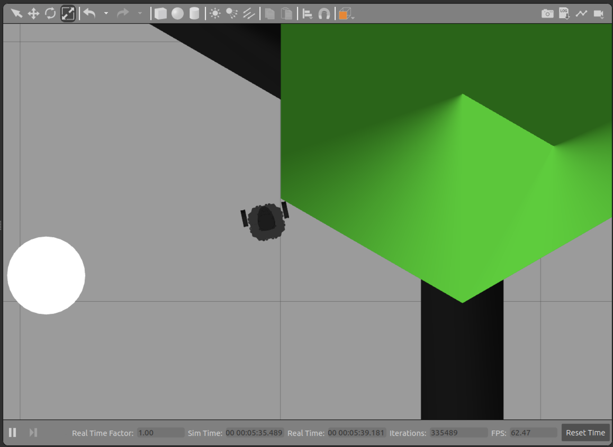

ROS_14
======

# 5. 2D 라이다
## 2D 라이다를 이용한 장애물 회피(2)


작업공간으로 이동한 후에 전에 만들었던 wanderbot 패키지로 이동하여 프로그램 컴파일.
```
cd ~/my_ws
cd src/wanderbot/src/
gedit go_scan.cpp
```

```
cd ../
gedit CMakeLists.txt

txt에서 추가.
add_executable(go_scan src/go_scan.cpp)
target_link_libraries(go_scan ${catkin_LIBRARIES})
```

다음으로 작업공간에서 catkin_make 실행 및 환경설정.
```
catkin_make
source devel/setup.bash
```

새로운 터미널 창. 작업공간 이동.
```
cd ~/my_ws
source devel/setup.bash
roslaunch turtlebot3_gazebo turtlebot3_world.launch
```

이전 터미널 창에서 노드를 실행.
```
rosrun wanderbot go_scan
```


<p align="left"></p>
위와 같이 걸림 발생. 따라서 더 이상 진행 불가. 이러한 에러는 전방 0도만 확인하기 때문.

앞에 있는 장애물은 인지 가능하지만, 조금 옆에 있는 장애물은 인지 불가. 이러한 에러를 해결하려면 충돌 예상 범위 안의 모든 방향에 대해 확인해야함.
범위를 그럼 어떻게 잡아야할까?  
너무 작게 잡으면 위와 같은 에러가 발생하고, 너무 넓게 잡으면 더 진행할 수 있음에도 접근하지 않음. 따라서, 적절한 범위를 계산하여 잡는 것이 해결 방법.
계산식 생략. 여유있게 양쪽 15도 총 30도 여유있게 범위 측정. 물론 움직임이 있는 장애물이 사각지대로 들어올 수 있지만 여기서는 생략.


코드 수정. 스캔 콜백 함수만 수정.

```
#include "ros/ros.h"
#include "geometry_msgs/Twist.h"
#include "sensor_msgs/LaserScan.h"

Float range_ahead;
#main에서 이용하기 위해 외부 변수로 선언.
#이렇게 하면 Scan 토픽이 수신될 때마다 정면 0도 방향의 거리가 range_ahead에 저장. 그 값이 출력.

void scan_cb(const sensor_msgs::LaserScan::ConstPtr& msg) {
  range_ahead = 3.0;
  for(int i=0; i<=15; i++) {
    if(msg->ranges[i] < range_ahead)
      range_ahead = msg->ranges[i];
  }
  for(int i=359; i>=345; i--) {
    if(msg->ranges[i] < range_ahead)
      range_ahead = msg->ranges[i];
  }
  #정면 0도 각도 방향의 장애물까지의 거리를 range_ahead에 저장 변수에 저장.  
  printf("range ahead: %f\n", range_ahead);
}

int main(int argc, char**argv) {
  ros::init(argc, argv, "go_scan");
  ros::NodeHandle n;
  ros::Publisher  cmd_pub = n.advertise<geometry_msgs::Twist>("cmd_vel",1);
  ros::Subscriber scan_pub = n.subscribe<sensor_msgs::LaserScan>("scan", 1, scan_cb);
  #토픽 구독. 자료형은 LaserScan, 토픽 이름 scan, 콜백함수 scan_cb.  
  ros::Rate loop_rate(10);
  geometry_msgs::Twist cmd;


#main 함수에서는 이렇게 측정한 거리에 따라 적절히 터틀봇을 조종할 수 있음.

ros::Rate loop_rate(10);
  geometry_msgs::Twist  cmd;

  while(ros::ok()) {
    if(range_ahead < 0.8) {
    cmd.linear.x = 0;
    cmd.angular.z = 0.2;
    } else {
        cmd.linear.x = 0.2;
        cmd.angular.z = 0;
    }
    cmd_pub.publish(cmd);
    ros::spinOnce();
    loop_rate.sleep();
  }
  
  return 0;
}
```

LaserScan 자료형 추가 소개.
라이다에는 측정이 가능한 최소 거리와 최대 거리가 있는데 그 값이 range_min, max에 담겨서 발행됨.
float32 range_min: minimum range value(m).  
float32 range_max: maximum range value(m).
따라서 일반적으로 range 배열 안의 모든 값들이 min보다는 크고 max보다 작아야함.
하지만 가끔씩 이 값들을 벗어나는 값이 들어올 때가 있음. 이러한 값들은 잘못된 값으로 사용하지 말아야함. 이러한 경우들은 실제 터틀봇에서 주로 발생하는데 range 배열 값이 0인 경우가 발생. 이게 센서가 잘못 측정한 값. 이러한 값을 그대로 이용하게 되면 마치 장애물이 거리 0m에 있는 것으로 인식됨.

따라서 다시 한번 코드 수정.

```
#include "ros/ros.h"
#include "geometry_msgs/Twist.h"
#include "sensor_msgs/LaserScan.h"

Float range_ahead;
#main에서 이용하기 위해 외부 변수로 선언.
#이렇게 하면 Scan 토픽이 수신될 때마다 정면 0도 방향의 거리가 range_ahead에 저장. 그 값이 출력.

void scan_cb(const sensor_msgs::LaserScan::ConstPtr& msg) {
  range_ahead = 3.0;
  for(int i=0; i<=15; i++) {
    if(msg->ranges[i] >= msg->range_min)
      if(msg->ranges[i] < range_ahead)
        range_ahead = msg->ranges[i];
  }
  for(int i=359; i>=345; i--) {
    if(msg->ranges[i] >= msg->range_min)
      if(msg->ranges[i] < range_ahead)
        range_ahead = msg->ranges[i];
  }
  #정면 0도 각도 방향의 장애물까지의 거리를 range_ahead에 저장 변수에 저장.  
  printf("range ahead: %f\n", range_ahead);
}

int main(int argc, char**argv) {
  ros::init(argc, argv, "go_scan");
  ros::NodeHandle n;
  ros::Publisher  cmd_pub = n.advertise<geometry_msgs::Twist>("cmd_vel",1);
  ros::Subscriber scan_pub = n.subscribe<sensor_msgs::LaserScan>("scan", 1, scan_cb);
  #토픽 구독. 자료형은 LaserScan, 토픽 이름 scan, 콜백함수 scan_cb.  
  ros::Rate loop_rate(10);
  geometry_msgs::Twist cmd;


#main 함수에서는 이렇게 측정한 거리에 따라 적절히 터틀봇을 조종할 수 있음.

ros::Rate loop_rate(10);
  geometry_msgs::Twist  cmd;

  while(ros::ok()) {
    if(range_ahead < 0.8) {
    cmd.linear.x = 0;
    cmd.angular.z = 0.2;
    } else {
        cmd.linear.x = 0.2;
        cmd.angular.z = 0;
    }
    cmd_pub.publish(cmd);
    ros::spinOnce();
    loop_rate.sleep();
  }
  
  return 0;
}
```

float32 angle_min: start angle of the scan [rad]
float32 angle_max: end angle of the scan [rad]
float32 angle_increment: angular distance between measurements [rad]
