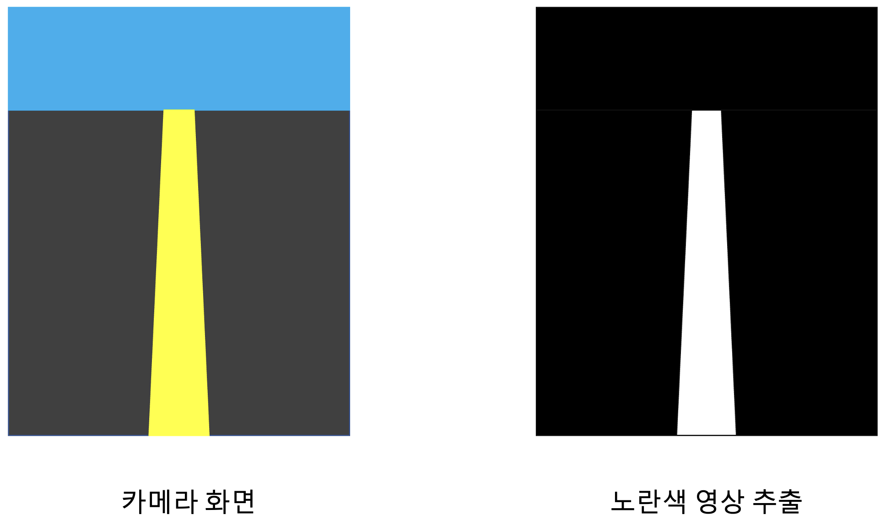
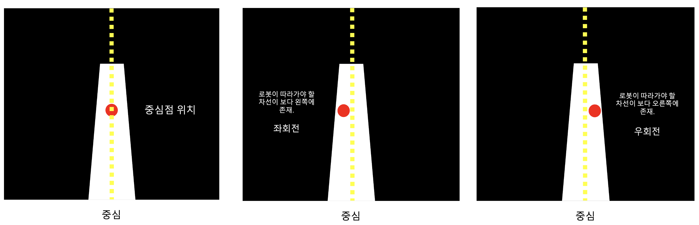
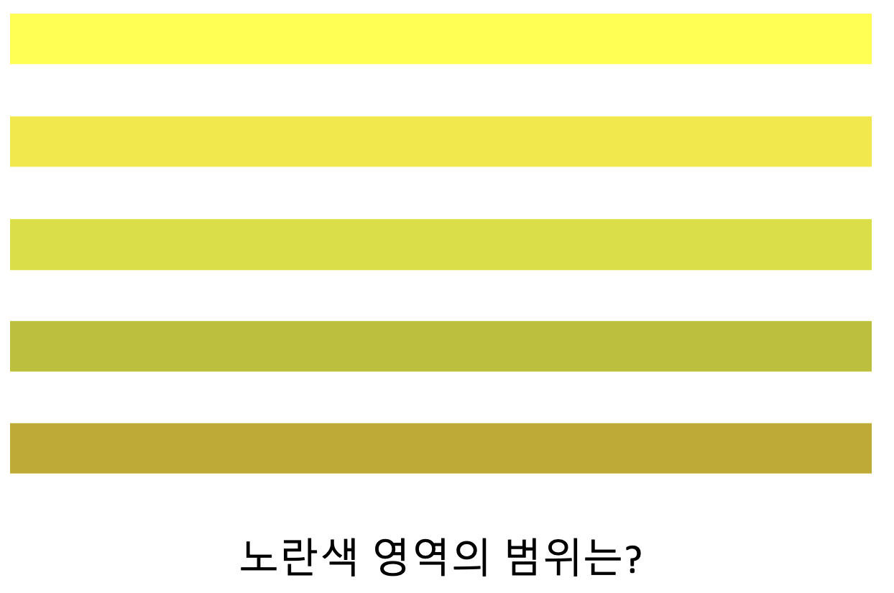

ROS_15
======

# 6.카메라
## 카메라와 영상처리

카메라: 영상 센서.
  - FPS: Frame Per Seconds. 
  - 픽셀(Pixel): 이미지를 이루는 점. 하나의 픽셀은 RGB로 이루어짐. 세개의 값으로 표현. 
  - 해상도: 픽셀의 개수(Full HD: 1920x1080, 4K: 3840x2160개의 픽셀로 이루어짐을 뜻함)
 
영상 처리: 출력된 영상으로 가공하는 작업.

대표적인 영상 처리 예제인 노란색 차선을 따라가는 프로그램을 만든다고 하자. 

. 

위 그림과 같이 노란색 중앙선이 있는 카메라의 영상 하나를 입력받으면 추출하는 그릠과 같이 하늘, 도로는 검정색으로 노란색 중앙선만 흰색으로 추출된다.   
그런데 경로를 잡으려면 너무 앞이나 너무 뒤가 아닌 중간 쪽을 목표로 움직여야 함. 그래서 적절한 부분을 골라내고 그 부분에 대해 중심점을 계산한다.   
이 중심점을 이용하여 로봇이나 차량을 제어. 노란색 점선은 화면의 중앙을 의미. 

 

이러한 부분에서 중요한게 노란색(특정색)을 추출하는 것.  
하지만 픽셀의 색을 rgb로 표현하게되면 어떤 특정한 색인지 구분하기가 쉽지 않음. 
즉, 아래의 그림과 같이 애매모호함. 조건값을 만들어내기가 어려움. 

.

따라서, RGB대신 HSV로 표현. 
HSV: 하나의 색을 Hue(색상), Saturation(채도), Value(명도)로 표현하는 방법.  

 
