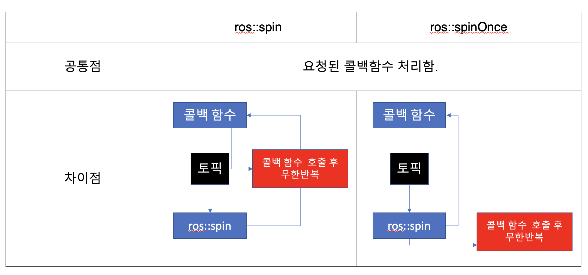

토픽 노드 발행 예제
===============

# 1씩 증가하는 값을 토픽으로 발행하는 노드
0,1,2,3,4 .... 전송하는 노드 만들기.

```cpp
#include "ros/ros.h"
#include "std_msgs/int32."
# 필요한 헤더파일들을 include

int main(int argc, char **argv){
  ros::init(argc, argv, "topic_pub"); 
  #ros::init, 이 프로그램이 ros의 노드임을 선언하면서 몇 가지 필요한 초기화를 진행. "topic_pub" = 노드의 이름
  ros::NodeHandle n; 
  #이후에 필요한 노드핸들러 선언, n 이름 선언
  ros::Publisher pub = n.advertise<std_msgs::int32>("counter", 1000); 
  #토픽 변수의 정의, publisher = 토픽 발행 변수, advertise = 토픽을 발행함을 주변에 알림
  #<> = 토픽으로 발행되는 메시지의 자료형, "counter" = 토픽의 이름.
  #노드와 토픽 선언 끝
  ros::Rate loop_rate(2);
  #while 반복문 주기 선언
  int count = 0;
  #while 반복만 안이 실제로 데이터를 토픽으로 전송하는 부분.
  while (ros::ok()){ 
  #ros::ok, ros가 실행되는 동안 true 노드가 정지되어 있으면 false. ros 실행되는 동안 반복.
    std_msgs::int32 msg; 
    #메시지 변수를 생성. 변수의 자료형은 토픽을 선언할 떄 설정한 자료형과 일치해야함. 즉, std_msgs가 토픽에 있는 <std_msgs::int32>와 일치.
    msg.data = count; 
    #메시지의 데이터에 카운트 값을 대입.
    
    pub.publish(msg); 
    #대입한 값을 토픽으로 발행. 이떄 앞에서 선언한 토픽변수를 이용.
    ros::spinOnce(); 
    #함수 실행.
    loop_rate.sleep(); 
    #ros::Rate로 앞서 선언되어있음. 2라는 값은 1초에 2번(0.5s) 실행되도록 시간간격을 둬라. 즉, 이 노드의 반복주기를 1초에 2번 0.5s 주기로 실행되도록 맞추는 부분.
    ++count; 
    #count값을 1 증가.
  }
  return 0;
}
```

<p align="center"></p>


요약.
1. ros가 실행되는 동안 계속 반복.
2. 반복주기는 lopp_rate.sleep()으로 조절.
3. (2) 1s에 2번 실행되도록 설정됨.
4. 한번 반복할 때마다 count 변수에 있는 값을 메시지에 넣어서 토픽으로 발행하고 1 증가시킴.
  
