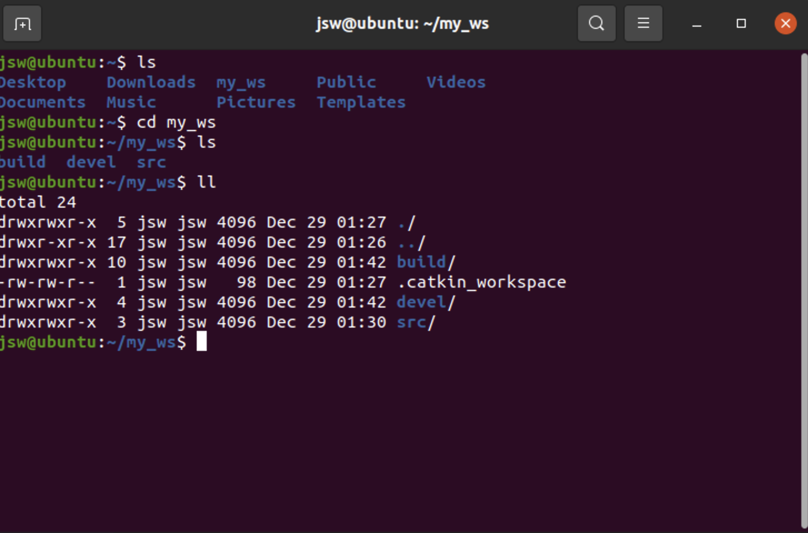
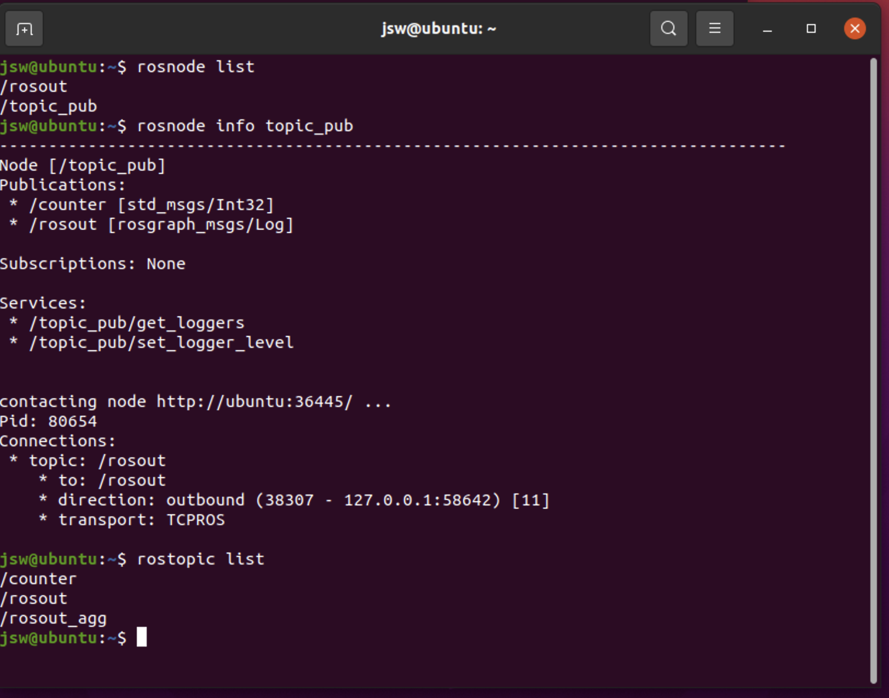

ROS_토픽 발행 노드 실행
===================

1. roscore 실행.
2. 작업 공간 생성.
  - 작업 공간: ROS에서 노드들을 만들고 실행하는 폴더, 혹은 디렉토리.
  ```
  mkdir -p ~/my_ws/src
  ``` 
  - 작업 공간 이름을 my_ws으로 한 것.
  - ~/my_ws/src로 이동.
  ```
  cd ~/my_ws/src
  ```
  - 작업 공간 초기화.
  ```
  catkin_init_workspace
  ```
  - my_ws로 이동 후.
  ```
  cd ..
  ```
  ```
  catkin_make
  ```
  <p align="left"></p>
  
  - 용어 정리.
    * catkin_make: catkin을 이용한 작업 과정에서 쓰이는 도구. 일반적으로 CMake 작업환경의 컴파일, 빌드 작업이 가능한 cmake와 make가 합쳐져 있는 도구라고 생각하면 된다.
    * catkin_ws(my_ws): catkin을 이용해서 작업할 수 있는 공간. package나 source의 수정, 빌드, 설치를 할 수 있는 폴더.
    * catkin_ws/build: source 폴더의 파일들을 빌드하기 위해 CMake가 호출되는 곳. CMake와 catkin의 캐쉬정보와 다른 중간 매개체의 파일을 보관.
    * catkin_ws/devel: catkin_make를 통해 빌드된 타깃이 배치되는 곳, 실행파일이 생성해당 폴더 내 setup.bash를 실행하면 빌드된 launch, source, msg, srv 등을 사용할 수 있음.(ROS 환경에 등록)
    
  - 이것으로 작업 공간 완성.    
 
 
3. 패키지 생성.   
  - 서로 연관된 소스코드 등을 모아놓는 단위. 하나 이상의 노드, 노드 실행을 위한 정보 등을 묶어 놓은 것. 또한, 패키지의 묶음을 메타패키지라 하여 따로 분리한다.
  ```
  cd ~/my_ws/src
  ```
  - topic_ex라는 디렉토리 생성. 
  - catkin_create_pkg는 패키지 생성 명령어. 
  - std_msgs는 ros에서 기본적으로 제공하는 메시지 자료형을 이용. 
  - roscpp는 패키지안의 노드들은 c언어로 기술.   
  ```
  catkin_create_pkg topic_ex std_msgs roscpp
  ```
  ```
  cd topic_ex/src
  ```
  - 이 안에 소스코드인 노드를 작성.(아래는 소스코드 이름)
  ```
  gedit topic_publisher.cpp
  ```
  - 소스코드 작성.(ROS_3.md에 기재된 소스코드)
  - 하나 위 디렉토리로 이동한 다음 CMakeLists.txt 파일 수정.
  ```
  add_executable(topic_publisher src/topic_publisher.cpp)
  #src 디렉토리 밑의 topic_publisher.cpp는 작성한 소스파일의 이름. 앞의 topic_publisher는 뒤에 있는 소스코드를 컴파일해서 만들어질 실행파일의 이름.
  target_Link_libraries(topic_publisher ${catkin_LIBRARIES})
  # 컴파일한 실행파일을 뒤에 있는 catkin_Libraries를 연결해서 실행파일을 만들어라.
  ```
  - my_ws로 이동.
  ```
  cd ~/my_ws
  ```
  - catkin_make 실행.
  - 컴파일 완료.
  - 환경설정. 여기 꼭 해줘야함.
  ```
  source devel/setup.bash
  ```
  - rosrun을 통해 노드 실행. topic_ex 패키지 안의 topic_publisher 노드의 실행 파일을 적음.
  ```
  rosrun topic_ex topic_publisher
  ```
  - 새로운 터미널 창을 열고 노드 실행 확인.
  ```
  rosnode list
  rosnode info topic_pub
  rostopic list
  rostopic echo counter -n 5
  ```
  <p align="left"></p>
  
  
