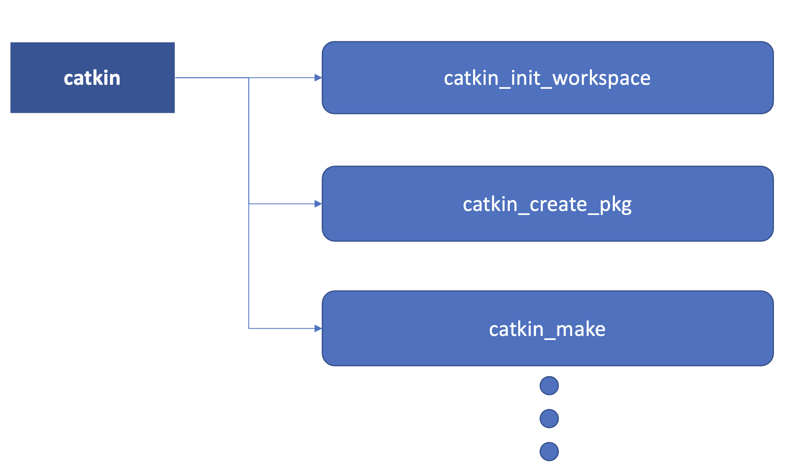

ROS 세부 설명
===========

ROS 마스터
  - 노드들에게 서로 연결할 수 있는 정보를 제공해서 서로 메세지를 전달할 수 있도록 해줌.
  - ros core를 실행하면 ros master를 비롯해서 몇 개의 ros 구동에 필요한 프로그램들을 실행.
  - 모든 노드는 시작할 때 발행하거나 구독하기를 원하는 메세지 스트림(토픽 등)같은 것들을 ros core에 등록.
  - 그러면 ros core는 이러한 정보를 검토해서 서로 연결이 필요한 노드들이 서로 p2p 연결을 형성할 수 있도록 노드들에게 정보를 제공.

1. roscore 실행.
2. counter 토픽을 발행하는 노드 실행이 되면 roscore에 노드는 counter 토픽을 발행함을 등록. 
3. counter 토픽을 구독하는 노드가 실행되면 이 노드 역시 자신이 counter 토픽을 구독함을 roscore에 등록.
4. roscore는 토픽을 구독하는 노드에게 발행하는 노드의 정보를 전달.
5. 이 정보를 이용해서 두 노드는 서로 P2P 통신을 통해 토픽을 전송.
  - 이 때, roscore는 처음 연결이 될 수 있도록 노드의 정보를 알려줄 뿐 실제로 통신에 관여하지 않음.
  - 토픽을 전달하는 통신은 노드와 노드 사이에만 이루어짐.
  - 노드들은 주기적으로 roscore에 접속하여 토픽을 발행 또는 구독하는 상대 노드 정보들을 파악.
  - roscore가 노드들의 정보를 관리해주기 때문에 노드들을 독립적으로 실행 가능.
  - 즉, 토픽을 구독하는 노드와 발행하는 노드의 실행 순서를 고려하지 않아도 되고 어느 한 노드를 중지시켰다가 다시 실행시켜도 전체적으로 문제없이 동작.

패키지(package) - 코드, 데이터, 문서의 집합. 어느 기능을 구현하려면 여러 노드가 필요할 때가 많은데 그러한 노드를 모아서 묶어놓은 것이 패키지.
- catkin_create_pkg가 패키지를 만드는 명령어.
- 그 안에 노드를 작성.
- 노드를 실행할 때도 rosrun한 다음에 바로 노드 프로그램을 지정하지 않고 패키지 이름도 같이 지정.

catkin - ros에서 사용하는 빌드시스템. 빌드시스템이란 소스코드를 컴파일하고 실행파일로 만드는 과정.

작업공간 - 소스코드들을 모아놓고 catkin으로 컴파일하는 공간.
작업공간안에는 여러 개의 패키지를 둘 수 있음. 여러 개의 작업공간을 가질 수 있지만 한 순간에는 하나의 작업공간에서만 작업 가능.

메세지 큐 - 전송 속도보다 더 빨리 토픽 발행, 실제 수신 속도보다 느리게 토픽을 처리하면 아직 전송되지 않거나 처리되지 않은 토픽이 쌓임. 이러한 토픽들을 쌓아놓는 곳이 메세지 큐이고 이 큐의 크기를 지정. 만약 큐의 크기보다 더 많이 토픽이 쌓이게 되면 오래된 토픽부터 잃어버림. 따라서 적절히 큐의 크기를 지정. 만약 토픽을 잃어버리면 안되는 경우 큐의 크기를 크게 해서 큐에 쌓여서 데이터를 잃어버리지 않게 함. 만약 최신 데이터를 빠르게 이용하고 싶으면 쌓인 토픽을 버리더라도 큐의 크기를 작게하면 가능함.
ros::Publisher pub = n.advertise<std_msgs::int32>("counter", 1000); 
여기서 1000이 메세지 큐의 크기
