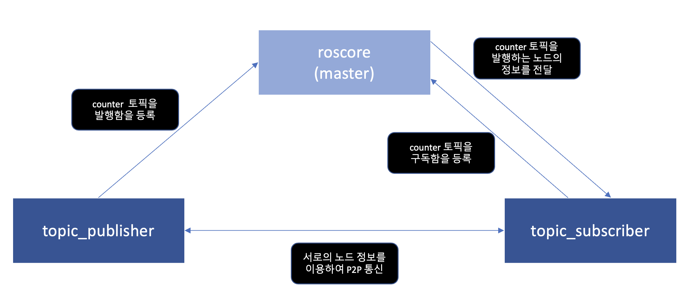

ROS 세부 설명
===========

ROS 마스터
  - 노드들에게 서로 연결할 수 있는 정보를 제공해서 서로 메세지를 전달할 수 있도록 해줌.
  - ros core를 실행하면 ros master를 비롯해서 몇 개의 ros 구동에 필요한 프로그램들을 실행.
  - 모든 노드는 시작할 때 발행하거나 구독하기를 원하는 메세지 스트림(토픽 등)같은 것들을 ros core에 등록.
  - 그러면 ros core는 이러한 정보를 검토해서 서로 연결이 필요한 노드들이 서로 p2p 연결을 형성할 수 있도록 노드들에게 정보를 제공.

